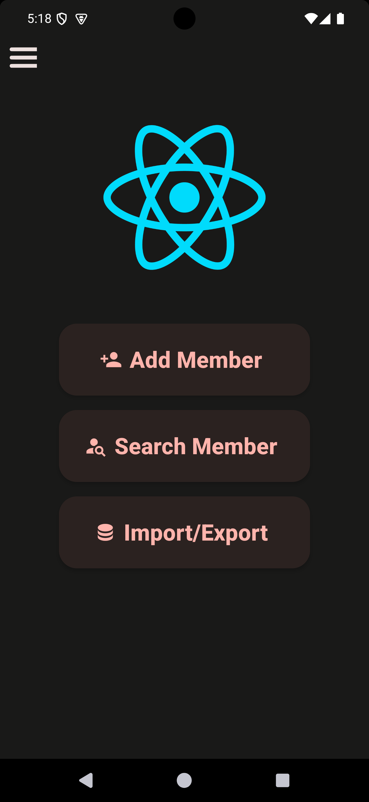
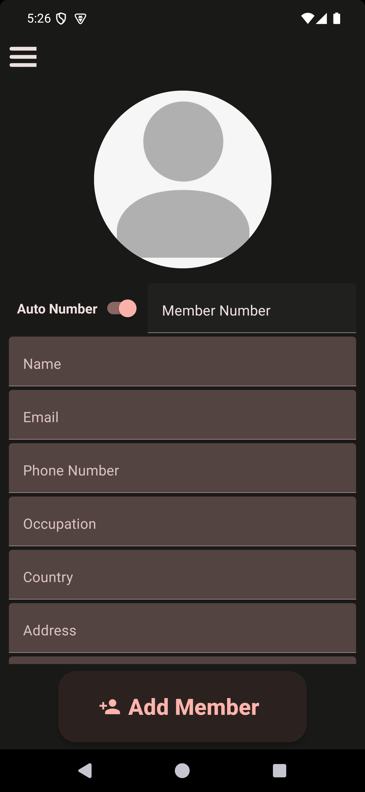
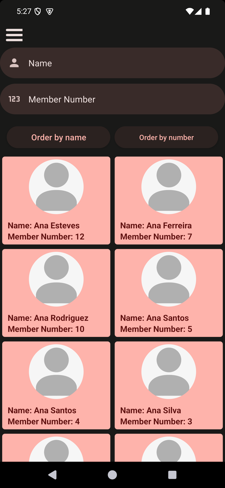
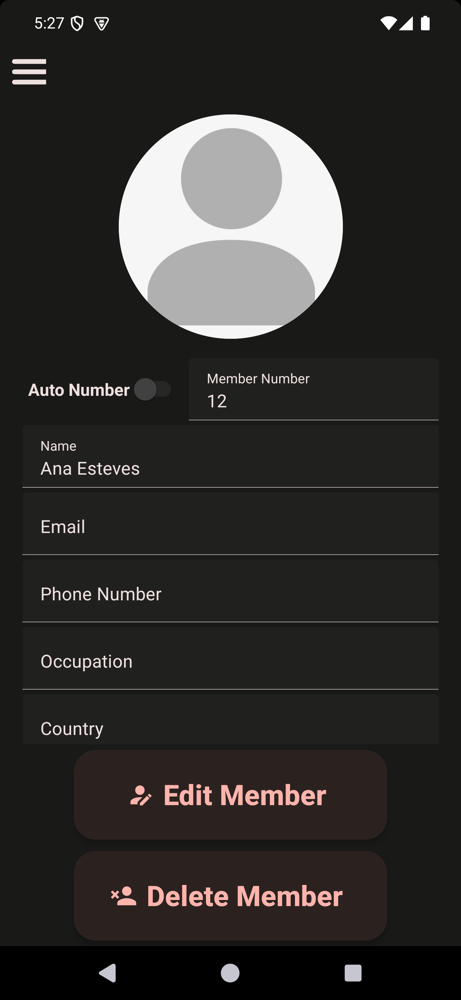
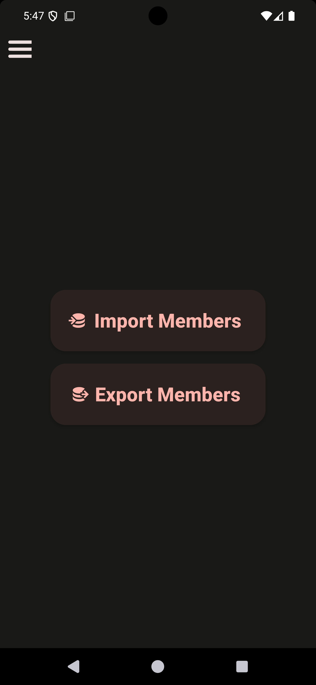
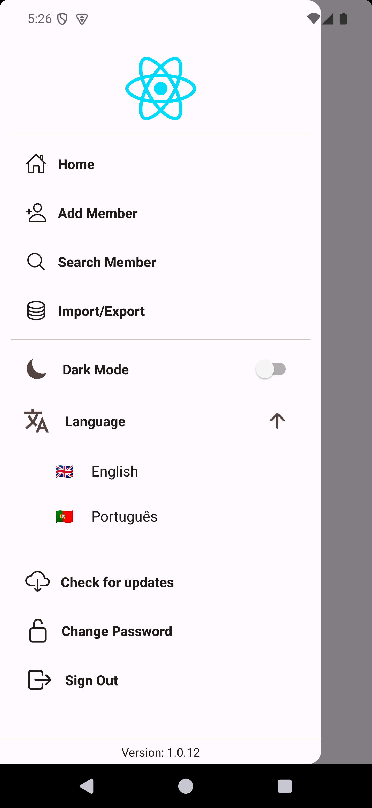
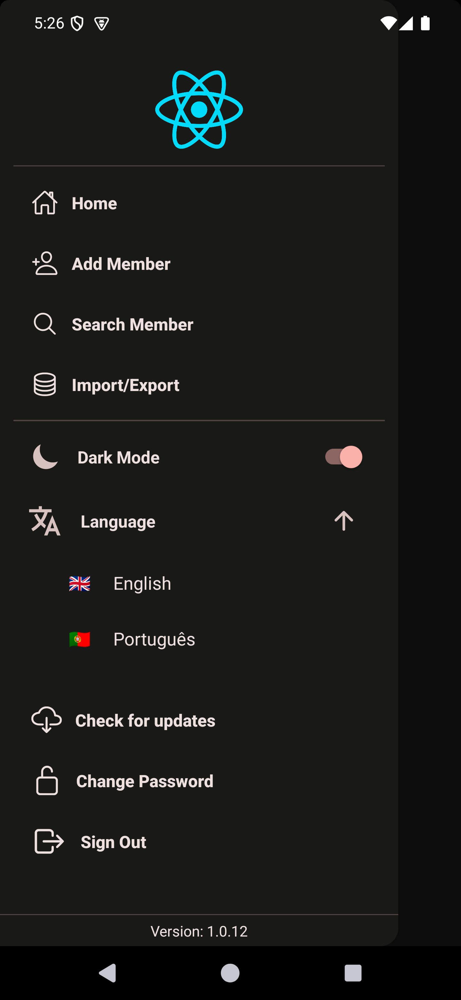

# Member Management App Project

This is a personal project created to improve member management.

It was developed with the intent to accurately, quickly and easily create a member profile, checking a member's information and other features, while making the information available anywhere by storing it in a cloud database.

## Features

### Main Features

- Add new Members to a cloud database
- Consult a specific member's information
- Edit a member's information
- Delete members
- Import/Export of members information to/from .csv files in order to facilitate sharing and/or editing

<p align='middle'>
  
  
  
  
  
</p>

### General Features

- Authentication to allow only trusted accounts to access the information (ability to freely create an account would be removed in a real world implementation or require email/account verification before allowing login)
- Changing Password
- Translation to different languages
- Light/Dark Theme
- Checking for updates (as it is a personal project, publishing in App Stores isn't feasible, so a different update checking system was implemented, not possible for iOS)

<p align='middle'>
  
  
</p>

## Tecnical Notes

- Member searches have a "fuzzy searching" implementation with a "hint" list to help the user find the intended member
- Update checking was implemented by having the APKs stored in Firebase Storage and then cross-checking the app's current version and the stored APKs version, downloading and updating if a more recent version is available (this isn't possible in iOS, as it doesn't allow sideloading)
- As all cloud functionalities (as is) require Firebase, in any reproduction of this project will require setting up Firebase (more specifically the modules detailed in the next section) and adding both config files (google-services.json and GoogleService-Info.plist) to the project
- Environment variables are used, so in any reproduction of this project setting them in a .env file (to run locally) and/or Expo (or other building framework) will be necessary. This is an .env example:

```
# Firebase Config Files
GOOGLE_SERVICES_JSON='./google-services.json'
GOOGLE_SERVICES_PLIST='./GoogleService-Info.plist'

# URL for placeholder profile pricture, stored in Firebase Storage
EXPO_PUBLIC_PLACEHOLDER_PICTURE_URL=xxxxxxxxxxxxxxxxxxxxxxxxxxxxxxxxxxxxx
```

## Tech used

This project was developed with the [React Native](https://reactnative.dev/) [Expo](https://expo.dev/) framework, using a mix of Typescript, CSS and some Javascript.

All cloud features are build using [Firebase](https://firebase.google.com/). The main Firebase features used are:

- [Firebase Authentication](https://firebase.google.com/products/auth) for user accounts authentication
- [Firestore](https://firebase.google.com/products/firestore) as a NoSQL DataBase to store data documents
- [Firebase Cloud Storage](https://firebase.google.com/products/storage) to store larger files (profile pictures, data exports and updates)

Some of the main packages used are:

- [Fuse.js](https://www.fusejs.io/) for fuzzy searching
- [i18next](https://www.i18next.com/) for translation implementation
- [React Native Paper](https://reactnativepaper.com/) for theming and appearance customization
- All other packages are present in package.json

## Developed by

- [Leandro Pata](https://github.com/LeandroPata)
